# GameEducator — Educação Continuada Gamificada

Projeto da AC1 de DevOps e QA. Aplicação Spring Boot para gestão de alunos, cursos e matrículas, com a regra de negócio de **cursos adicionais por desempenho** construída via TDD (RED/GREEN/BLUE) no pacote `domain`.

## Grupo 1

| Integrante | E-mail / GitHub |
|---|---|
| Luiza Bottesi | luizabottesi3@gmail.com |
| Eduardo Bressan Paixão | eduardopaixao160@gmail.com |
| João | joaoguifl350@gmail.com |
| Felipe Rondello A. Lopes | ferondellodev@gmail.com |

## Descrição do case

**Educação Continuada Gamificada**: uma plataforma de ensino que recompensa o desempenho do aluno. Ao concluir um curso com média acima de 7,0, o aluno ganha o direito de realizar mais 3 cursos gratuitamente — um mecanismo de gamificação para incentivar a continuidade dos estudos e fidelizar o aluno à plataforma.

## User Stories

> **US escolhida para implementação** (autoria: Felipe Rondello A. Lopes):
>
> **COMO** administrador da plataforma,
> **QUERO** que o aluno, ao terminar um curso com média acima de 7,0, tenha direito à realização de mais 3 cursos,
> **PARA** fidelizar alunos a longo prazo e garantir qualidade de ensino.

| Integrante | Eu como | Preciso/Quero | Para |
|---|---|---|---|
| **Felipe Rondello A. Lopes** *(US escolhida)* | Administrador da plataforma | Que o aluno, ao terminar um curso com média acima de 7,0, tenha direito à realização de mais 3 cursos | Fidelizar alunos a longo prazo e garantir qualidade de ensino |
| **Eduardo Bressan Paixão** | Aluno | Pagar um valor mensal e ter acesso a um conjunto de cursos para assinatura básica | Ter oportunidade de conhecimentos variados com um valor acessível |
| **Luiza Bottesi** | Aluno | Obter assinatura "Premium" ao conquistar 12 cursos | Poder ter acesso a mais modalidades e funcionalidades dentro da plataforma |
| **João** | Aluno | Obter um curso no final do mês ao ajudar outros alunos e escrever tópicos no fórum | Poder ter acesso a mais conteúdo através de um incentivo para a comunidade dentro da plataforma |

O grupo optou por implementar a US do Felipe como núcleo do domínio; os BDDs de cada integrante (abaixo) foram construídos como cenários e casos de borda dessa mesma regra, e todos estão conectados na API real.

## BDD por integrante — Acceptance Criteria

| Integrante | Given | When | Then | Teste (`domainTest`) |
|---|---|---|---|---|
| **Felipe Rondello A. Lopes** | Dado que o aluno finalize o curso com média maior que 7,0 | Quando for resgatar seus 3 cursos | Então tenha a escolha de resgatar 3 entre 10 cursos relacionados ao que concluiu | `ResgateDeCursosRelacionadosTest` |
| **Eduardo Bressan Paixão** | Dado que o aluno já utilizou os 3 cursos adicionais concedidos anteriormente | Quando ele finalizar um novo curso com média acima de 7,0 | Então o sistema deve conceder novamente mais 3 cursos adicionais | `CursosAdicionaisAposUsoTest` |
| **Luiza Bottesi** | Dado que o aluno está cursando um curso na plataforma | Quando ele finalizar o curso com média acima de 7,0 | Então ele deve ter direito a realizar mais 3 cursos | `PlataformaEnsinoTest` |
| **João** | Dado que o aluno finalizou um curso com média exatamente igual a 7,0 | Quando o sistema verificar sua elegibilidade para cursos adicionais | Então ele NÃO deve ter direito a realizar mais 3 cursos | `ElegibilidadeDeCursosAdicionaisTest` |

## TDD — RED, GREEN e BLUE

O ciclo foi feito sobre o pacote `domain` (`Aluno`, `Curso`, `Matricula`, `PlataformaEnsino`, `Resgate`, `StatusMatricula` e os Value Objects em `domain/vo`), testado em `domainTest`.

- **RED:** testes escritos antes da implementação, falhando.
- **GREEN:** implementação mínima para os testes passarem.
- **BLUE:** refatoração (extração de Value Objects, remoção de estado indevido em `PlataformaEnsino`, alinhamento com o modelo de domínio da disciplina) mantendo os testes verdes.

A cobertura do JaCoCo é restrita ao pacote `domain/**` (configurado em `pom.xml`), porque a exigência de 100% vale apenas para o exercício de TDD, não para o projeto inteiro.

### RED — testes escritos antes da implementação, falhando

| Eduardo | Felipe | João | Luiza |
|---|---|---|---|
| 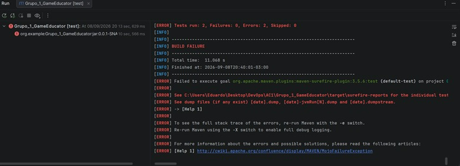 | 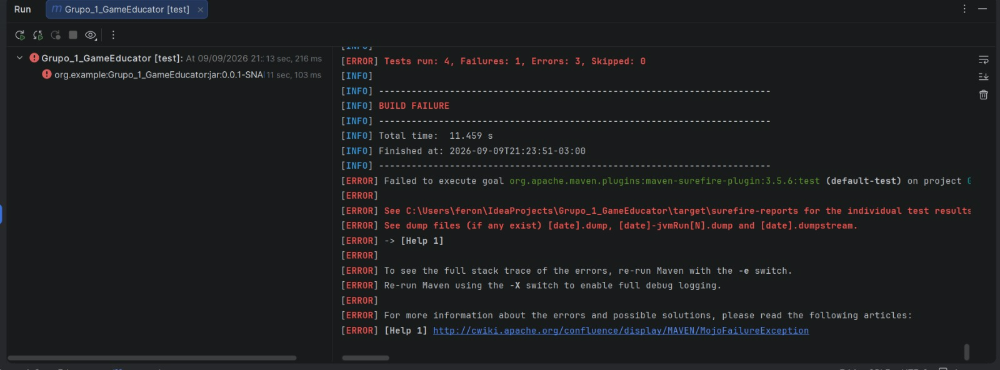 | 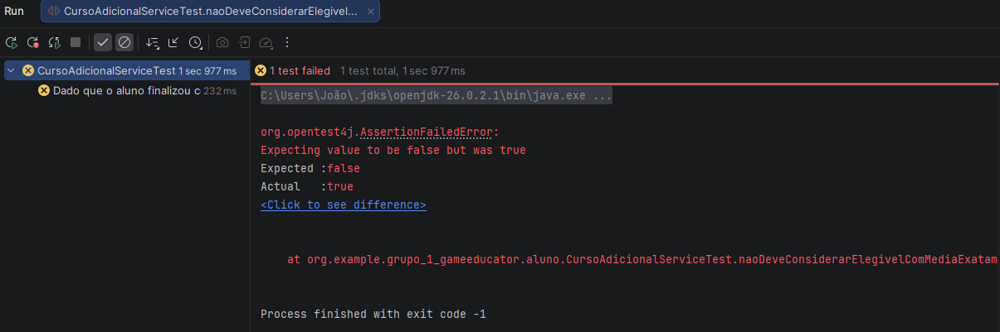 | 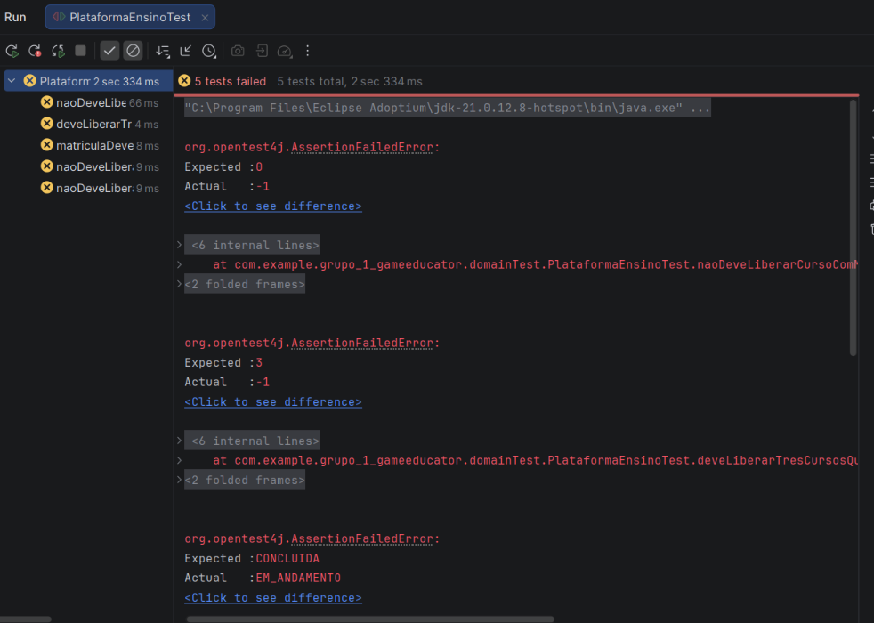 |

### GREEN — implementação mínima, todos os testes passando

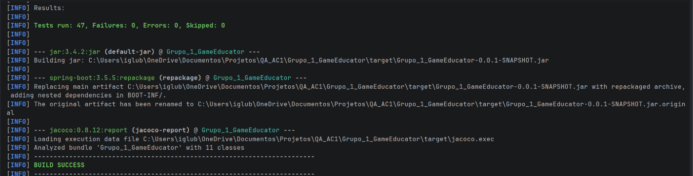

### BLUE — refatorado, todos os testes passando, 100% de cobertura no domínio sem vermelho/amarelo


| Relatório JaCoCo — parte 1 | Relatório JaCoCo — parte 2 |
|---|---|
| 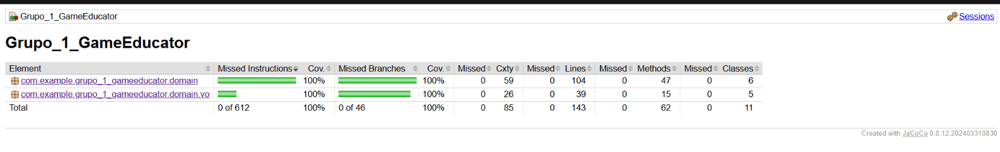 | 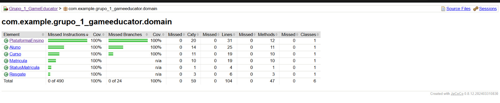 |

> As fotos antigas em `docs/evidencias/fotos-luiza/` são da primeira rodada, anterior à extração dos Value Objects — não refletem mais o código atual. Pode apagar essa pasta.

## Arquitetura

```
domain/          regras de negócio (TDD), também é a camada JPA (@Entity)
domain/vo/       Value Objects (@Embeddable): NomeAluno, EmailAluno, TituloCurso, DescricaoCurso, AreaCurso
repository/      Spring Data JPA
service/         orquestração, chama as regras do domain
dto/             entrada/saída da API
controller/      REST controllers + Swagger
```

## Endpoints principais

| Método | Rota | Descrição |
|---|---|---|
| GET | `/api/alunos` | Lista alunos |
| GET | `/api/alunos/{id}` | Busca aluno por id |
| POST | `/api/alunos` | Cria aluno |
| GET | `/api/cursos` | Lista cursos |
| POST | `/api/cursos` | Cria curso |
| POST | `/api/matriculas` | Matricula aluno em curso |
| PUT | `/api/matriculas/{id}/concluir` | Conclui matrícula com média final |
| GET | `/api/matriculas/{id}/resgate` | Resgata cursos relacionados (cenário do Felipe) |
| GET | `/api/matriculas/aluno/{alunoId}` | Lista matrículas de um aluno |

Documentação interativa: `/swagger-ui/index.html`.

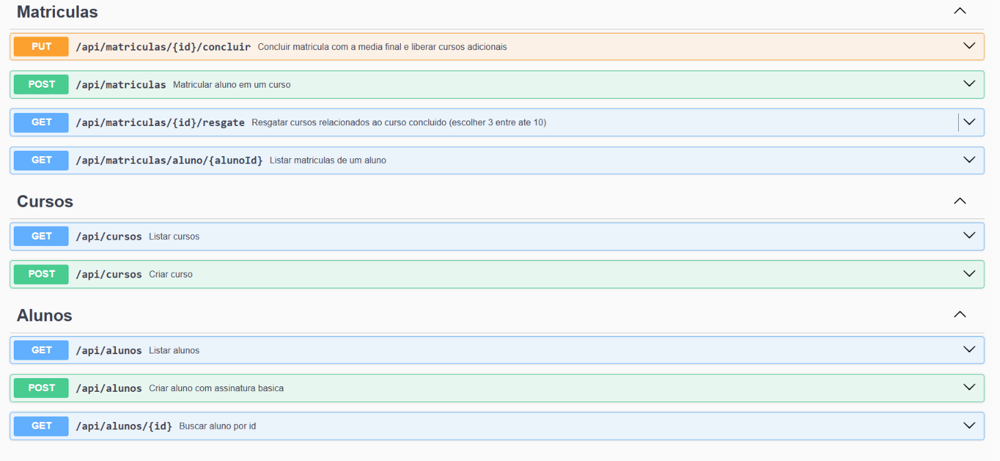

## Como rodar

### Local, com H2 (banco em memória)

```powershell
mvn spring-boot:run "-Dspring-boot.run.profiles=h2"
```

- Aplicação: http://localhost:8080
- Swagger: http://localhost:8080/swagger-ui/index.html
- Console H2: http://localhost:8080/h2-console (JDBC URL `jdbc:h2:mem:gameeducatordb`, usuário `sa`, senha em branco)

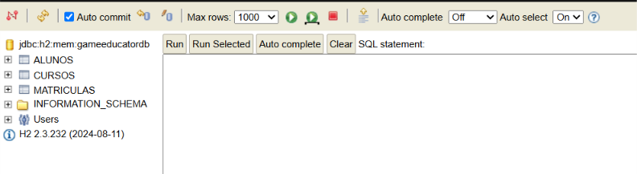

### Via Docker, com Postgres + pgAdmin

```powershell
docker compose down -v
docker compose up --build
```

- Aplicação: http://localhost:8080
- pgAdmin: http://localhost:5050 (login `admin@admin.com` / senha `admin`)
- Postgres (dentro da rede do compose): host `postgres`, porta `5432`, banco `gameeducator_db`, usuário/senha `postgres`

> Se a porta 5432 já estiver em uso por um Postgres local, altere o mapeamento de portas do serviço `postgres` no `docker-compose.yml` para `"5433:5432"` — a comunicação interna entre os containers continua em `5432`.

| Docker Desktop — containers rodando | pgAdmin — banco Postgres |
|---|---|
| 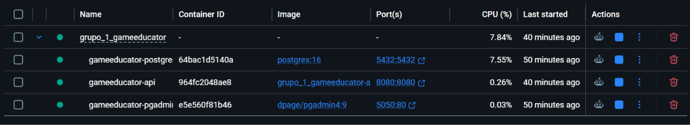 | 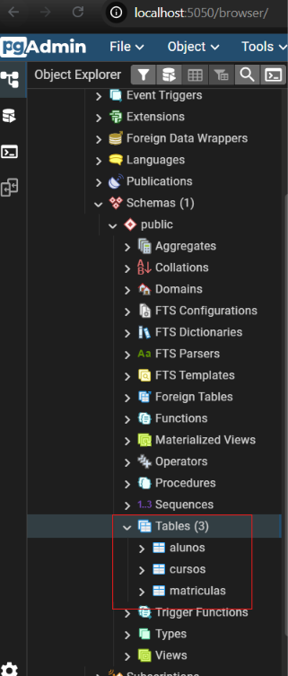 |

## Testes

```powershell
mvn clean verify
start target\site\jacoco\index.html
```

## Planilha

As User Stories e os BDDs completos do grupo também estão detalhados na planilha **"Grupo1 - US e BDD"**, enviada junto com este projeto no Canvas.
